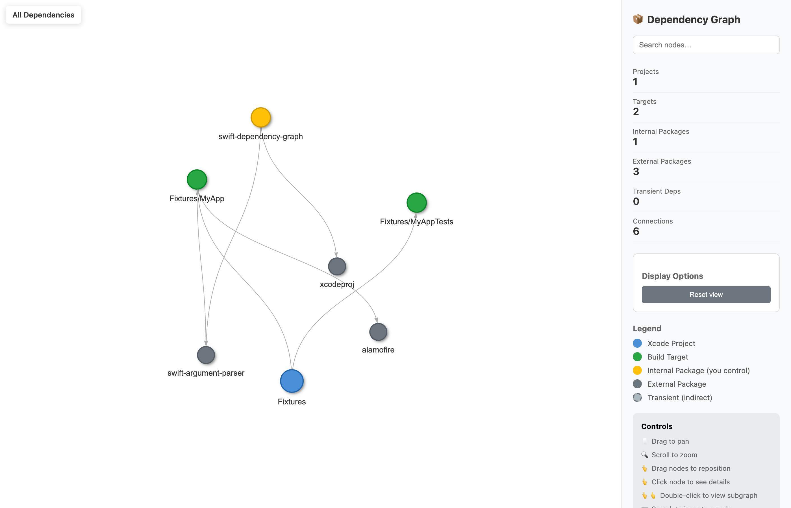

# swift-dependency-graph

A Swift CLI tool that scans an iOS repo (Xcode projects/workspaces + SwiftPM) and produces a dependency graph for visualization and pinch-point analysis.

## Build

```bash
swift build -c release
```

Binary: `.build/release/DependencyGraph`

## Quickstart

Recommended: use the Makefile (it encodes the common workflows + flags).

```bash
# Fast HTML (targets + no transient)
make html-fast PROJECT=/path/to/ios-project

# Full HTML (targets + spm-edges)
make html-full PROJECT=/path/to/ios-project

# Analyze modular pinch points
make analyze PROJECT=/path/to/ios-project
```

## CLI

```bash
# Generate a graph
.build/release/DependencyGraph graph /path/to/root --format html --show-targets --spm-edges > graph.html

# Diff two graphs (stable across machines)
.build/release/DependencyGraph diff /path/to/old /path/to/new --format json --stable-ids > diff.json
```

## Flags (common)

| Option | Description |
|--------|-------------|
| `--format <format>` | `html`, `json`, `dot`, `gexf`, `graphml`, `analyze` |
| `--hide-transient` | Hide transient (non-explicit) dependencies |
| `--show-targets` | Include Xcode build targets |
| `--spm-edges` | Add SwiftPM package→package edges via `swift package show-dependencies --format json` (skipped when `--hide-transient`) |
| `--stable-ids` | Use stable, collision-free node ids (schema v2; default on, disable with `--no-stable-ids`) |

## What it looks like



Sample outputs for *this* repo:
- HTML: [`docs/examples/swift-dependency-graph.html`](./docs/examples/swift-dependency-graph.html)
- JSON: [`docs/examples/swift-dependency-graph.json`](./docs/examples/swift-dependency-graph.json)
- Analyze: [`docs/examples/swift-dependency-graph.analyze.txt`](./docs/examples/swift-dependency-graph.analyze.txt)

## Documentation

- [docs/README.md](./docs/README.md) (graph model, HTML UI, architecture, testing)
- [roadmap.md](./roadmap.md)
- [TICKETS.md](./TICKETS.md)

## Contributing / Security / License

- [CONTRIBUTING.md](./CONTRIBUTING.md)
- [SECURITY.md](./SECURITY.md)
- [LICENSE](./LICENSE) (MIT)

